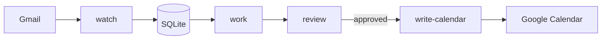

# Family Assistant

[](https://github.com/wsabol/family-assistant/actions/workflows/ci.yml)
[](LICENSE)

Local family executive assistant that watches Gmail for school-related messages, extracts proposed calendar actions with AI, requires human review, and writes approved events to Google Calendar.

**Philosophy:** reliable, transparent, and reversible. AI proposes; you approve. Nothing hits your calendar without an explicit human decision.

## Features

- Poll Gmail for messages with a label you choose
- Extract events, deadlines, and reminders with OpenAI structured output
- Review and edit proposals in a local web UI (localhost only)
- Create approved events on a dedicated school calendar
- Full audit trail in SQLite (source email → proposed action → calendar event)
- Daily markdown digest and `launchd` templates for macOS automation

## Requirements

- Node.js 20 or newer
- npm
- Google Cloud project with Gmail API and Calendar API enabled
- OpenAI API key

## Quick start

```bash
git clone https://github.com/wsabol/family-assistant.git
cd family-assistant
npm install
cp .env.example .env
cp config/family.example.json config/family.json
```

1. Follow [docs/google-cloud-setup.md](docs/google-cloud-setup.md) for OAuth credentials and API access.
2. Edit `config/family.json` with your timezone, Gmail label, children, and school calendar ID.
3. Set `AI_API_KEY` (and other values) in `.env`.

```bash
npm run migrate
npm run dev -- auth gmail
npm run dev -- auth calendar
npm run doctor
```

When doctor reports **Overall: PASS**, you are ready to run the pipeline.

## Daily workflow

```bash
npm run dev -- watch          # ingest labeled Gmail messages
npm run dev -- work           # AI extraction for queued messages
npm run dev -- review         # local review UI at http://127.0.0.1:3847
npm run dev -- write-calendar # create events for approved actions
npm run dev -- digest         # markdown summary in data/digests/
npm run dev -- status         # queue and review counts
```

After building:

```bash
npm run build
npx family-assistant watch
```

## CLI commands

| Command | Description |
|---------|-------------|
| `auth gmail` | OAuth for Gmail (read + label) |
| `auth calendar` | OAuth for Calendar events |
| `watch` | Poll Gmail for labeled messages |
| `work` | Process queued messages with AI |
| `review` | Start review web UI (localhost) |
| `approve <id>` | Approve action from CLI |
| `reject <id>` | Reject action from CLI |
| `reprocess <message-id>` | Re-run AI; supersedes prior awaiting/approved actions |
| `write-calendar` | Create Google Calendar events |
| `digest` | Write daily markdown digest |
| `status` | Show queue status |
| `doctor` | Health checks |
| `migrate` | Apply database migrations |
| `launchd:generate` | Build `launchd/` plists from templates |
| `launchd:load` | Generate, copy to LaunchAgents, `launchctl bootstrap` |

## Architecture



Each stage has strict boundaries: the watcher never calls AI or Calendar; the worker never writes Calendar; only approved actions are written. See [docs/architecture.md](docs/architecture.md).

## Reprocessing

`reprocess` marks existing `awaiting_review` and `approved` actions as `superseded`, then queues the message for a fresh AI extraction. Original records are preserved for audit.

## Automation (launchd)

Example plists are generated from [`launchd-template/`](launchd-template/) into [`launchd/`](launchd/) (gitignored):

```bash
npm run launchd:generate
```

Install into LaunchAgents and load (regenerates plists first):

```bash
npm run build
npm run launchd:load
```

Suggested schedule: watcher/work/calendar-writer every 5 minutes; digest daily at 8pm.

## Data and privacy

Everything runs on your machine:

- SQLite database: `DATABASE_PATH` (default `./data/family-assistant.db`)
- OAuth tokens: `GOOGLE_TOKEN_PATH`, `GOOGLE_CALENDAR_TOKEN_PATH`
- Logs: `LOG_DIR`
- Digests: `DIGEST_DIR`

Back up the database and token files regularly. They are not committed to git. See [SECURITY.md](SECURITY.md).

## Family config

`config/family.example.json` shows the shape. Per child:

| Field | Description |
|-------|-------------|
| `name` | Child name |
| `aliases` | Optional nicknames for AI matching |
| `school` | School name |
| `startedKindergarten` | Calendar year they started kindergarten (e.g. `2020`) |

Grade is derived at runtime — do not add a `grade` field.

## Development

```bash
npm run typecheck
npm test
npm run test:watch
```

See [CONTRIBUTING.md](CONTRIBUTING.md) for guidelines, architecture rules, and how to open a pull request.

## Project status

Implemented:

- Milestone 1: project foundation
- Milestone 2: Gmail watcher
- Milestone 3: AI extraction worker (OpenAI)
- Milestone 4: Review interface (server-rendered)
- Milestone 5: Calendar writer
- Milestone 6: Digest, launchd templates, operations docs

Pending:

- Milestone 7: Evaluation fixture corpus and hardening (collect historical school emails)

See [`.product/mvp.md`](.product/mvp.md) for the full plan.

## Contributing

Contributions are welcome. Please read [CONTRIBUTING.md](CONTRIBUTING.md) and the [Code of Conduct](CODE_OF_CONDUCT.md) before opening a pull request.

## License

[MIT](LICENSE) — Copyright (c) 2026 Will Sabol
