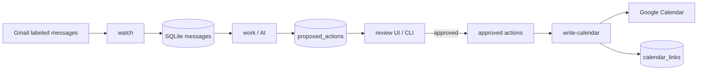

# Architecture

Family Assistant is a local pipeline that turns labeled school emails into reviewed Google Calendar events. Each stage has a narrow responsibility; crossing boundaries (for example, the worker writing to Calendar) is intentionally prevented.

## Pipeline overview

## Stages

| Command | Module | Responsibility |
|---------|--------|----------------|
| `watch` | `src/gmail/` | Poll Gmail, normalize messages, dedupe by `gmail_message_id`, queue for processing |
| `work` | `src/ai/` | Claim queued messages, call OpenAI with structured output, store proposed actions |
| `review` | `src/review/` | Local web UI (localhost) and CLI approve/reject; preserve original vs approved payloads |
| `write-calendar` | `src/calendar/` | Create events only for `approved` actions; idempotent via `calendar_links` |

### Boundaries

- **Watcher** does not call AI or Calendar.
- **Worker** does not write Calendar.
- **Calendar writer** only processes explicitly approved actions and skips actions that already have a calendar link.

## Data model

SQLite (WAL mode) with versioned migrations in `migrations/`.

Key tables:

- `messages` — source emails and processing status (`queued`, `processing`, `completed`, `failed`)
- `proposed_actions` — AI extractions with status (`awaiting_review`, `approved`, `rejected`, `superseded`, `writing`, `completed`, `failed`)
- `calendar_links` — maps `proposed_action_id` to Google Calendar event ID (unique index prevents duplicates)

Audit fields:

- `original_payload_json` — never overwritten (AI output at extraction time)
- `approved_payload_json` — set when a human approves or edits from the review UI

## Reprocessing

`reprocess <message-id>` marks existing `awaiting_review` and `approved` actions as `superseded`, resets the message to `queued`, and runs AI extraction again. Prior records remain for audit.

## Stale recovery

`STALE_PROCESSING_MINUTES` (default 30) resets stuck `processing` messages and `writing` actions so a crashed run can resume.

## Configuration

| File | Purpose |
|------|---------|
| `.env` | Paths, secrets, batch limits (see `.env.example`) |
| `config/family.json` | Timezone, children, Gmail label, calendar ID (see `config/family.example.json`) |

Grade is computed at runtime from `startedKindergarten`; it is not stored in config.

## Automation

On macOS, `launchd-template/` plists are rendered into `launchd/` (gitignored) and loaded with `npm run launchd:load`. Typical schedule: watch/work/write every 5 minutes; digest daily.

## Further reading

- [Product MVP plan](../.product/mvp.md) — full scope and milestones
- [CONTRIBUTING.md](../CONTRIBUTING.md) — development and PR guidelines
